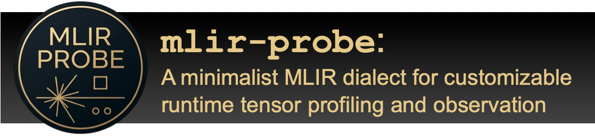

<p align="center">
  </br>
</p>

`probe` is a small MLIR dialect which can be used to profile/observe runtime
values for tensors. You can customize which profiling actions are applied by
providing the implementation of the profiling (or "probe") function.

## Operations
The `probe` dialect provides two operations: `probe.observe` and
`probe.report`, which are better explained below. Note that we don't provide
any passes to actually insert these ops in the IR. It is the user's
responsibility to determine when and where to insert each of these ops.

### `probe.observe`
This operation takes a tensor value as an input and it
represents an "observation" on said tensor. This could mean anything, depending
on its implementation. You can see this op as an abstraction for profiling a
tensor (either of type `tensor` or `memref`). This operation should not have
any side effects, and it is the implementer's responsibility to ensure this.
Moreover, the operation has two mandatory attributes: `opID` and `resultID`,
which are better explained in the [Probe functions](#probe-functions) section.

```mlir
func.func @foo() {
  // ...
  %0 = linalg.add ins(%tensor0, %tensor1 : tensor<2x2xf32>, tensor<2x2xf32>) outs(%out0: tensor<2x2xf32>) -> tensor<2x2xf32>
  probe.observe(%0: tensor<2x2xf32>) {opID = 0 : i32, resultID = 0 : i32}
  // ...
  %1 = linalg.matmul ins(%tensor2, %tensor3 : tensor<100x?xi64>, tensor<100x?xi64>) outs(%out1: tensor<100x?xi64>) -> tensor<100x?xi64>
  probe.observe(%1: tensor<100x?xi64>) {opID = 1 : i32, resultID = 0 : i32}
  // ...
}
```

### `probe.report`
This operation is used to indicate that observations for
all tensors seen so far should be reported. The actual format used to represent
this information also depends on implementation. This operation is needed to
indicate when to "consolidate" observations that have been made during the
program's execution.

```mlir
func.func @foo() {
  // ...
  probe.observe(%0: tensor<2x2xf32>) {opID = 0 : i32, resultID = 0 : i32}
  probe.observe(%1: tensor<2x2xf32>) {opID = 0 : i32, resultID = 1 : i32}
  // ...
  // ...
  probe.observe(%2: tensor<100x?xi64>) {opID = 1 : i32, resultID = 0 : i32}
  // ...
  probe.report() // Will produce some report at runtime
  return
}
```

## Passes
There is only one pass provided as part of the dialect:
`probe-lower-to-func-calls`. It lowers all `probe` operations to function
calls. Notice that this should always be called after bufferization, and
therefore it will only work with `probe.observe` ops with `memref` inputs.
We do not provide any passes to insert `probe` ops in the IR, as the dialect's
users are expected to do this. To register this pass in your project, you can
use the `mlir::probe::registerProbePasses` function.

## Probe functions
To actually define the behavior for `probe` operations, you must implement
functions which will be linked against the program. These are the functions
you need to implement:

- **Observe function (default prefix name: `probeObserveMemref`)**: This
function defines the behavior for the `probe.observe` op. It implements the
observation/profiling action. The function should take three arguments:
  - `UnrankedMemRefType<T> memref`: Descriptor for a memref of type `T`, which
  is being observed. Notice that you must implement one "observe" function for
  each possible element type in your IR. So, for instance, if your IR can
  have `f32` and `ui8` tensors, you should implement `probeObserveMemrefF32` and
  `probeObserveMemrefUI8`.
  - `int32_t opID`: Unique identifier for the operation which produced this
  memref/tensor.
  - `int32_t resultID`: Index of this memref/tensor in the results of
  the defining operation.
- **Report function (default name: `probeReport`)**: This function defines the
behavior for `probe.report`. It implements the logic for reporting observed
values, which could be presented in any desired format. The function shouldn't
take any arguments.

There are a few important details you should be aware of when implementing
probe functions:
- You will typically need to add the `_mlir_ciface_` prefix in their names,
which is added by MLIR to externally defined functions.
- When using shared libraries, remember to guarantee that probe functions have
external linkage and that they are exported by the library (for instance, by
using `__attribute__((visibility("default")))`).
- When implementing the probe functions in C++, use `extern "C"` to avoid
issues with name mangling.
- Probe function should **not** modify tensors. Bufferization expects that
`probe` operations only read tensors/buffers. Therefore, you should not
modify values to avoid issues and undesired side effects.

You can find an implementation example for probe functions in the
[`tests/example`](tests/example/) directory. This example implements a 
function to collect the sums of tensors, and only prints them to stdout. This
implementation is compiled to a shared library, which can be used along with
the `mlir-runner` tool, like in the
[`end-to-end.mlir`](tests/probe/end-to-end.mlir) test.

## Usage
### Dependencies
`probe` has only been tested with LLVM/MLIR 21 on Linux. We don't guarantee it
works with other versions and OS's. Here's a suggestion of commands that can
be used to download and build LLVM in the correct version:

```bash
git clone -b llvmorg-21.1.0 https://github.com/llvm/llvm-project.git
mkdir llvm-project/build
cd llvm-project/build
cmake -G Ninja ../llvm                  \
    -DLLVM_ENABLE_PROJECTS="mlir;clang" \
    -DLLVM_BUILD_EXAMPLES=ON            \
    -DLLVM_TARGETS_TO_BUILD=host        \
    -DCMAKE_BUILD_TYPE=Release          \
    -DLLVM_ENABLE_ASSERTIONS=ON         \
ninja
```

For more information on how to build LLVM, you can check
[Prof. Fernando Pereira's video](https://www.youtube.com/watch?v=l0LI_7KeFtw)
on the topic.

### Building and testing
Generally, you'll want to build `probe` along as part of your own project.
However, if you want to build and test `probe` separately, we provide the
`probe-opt` tool, which can be used to test the dialect's ops and passes. We
also provide a set of LIT tests, which you can use to test the project. Here's
a suggestion of commands to build and test `probe` as a standalone projet:
```bash
mkdir -p build
# LLVM_BUILD_DIR is the directory where you have built LLVM
cmake -S . -B build/ -G "Ninja"                   \
    -DLLVM_DIR=${LLVM_BUILD_DIR}/lib/cmake/llvm   \
    -DMLIR_DIR=${LLVM_BUILD_DIR}/lib/cmake/mlir
ninja -C build/ check-probe
```

### Installation
You can add this project as a dependency to your project using CMake. There are
two main libraries which should be linked against your targets:
[`MLIRProbeDialect`](lib/Dialect/Probe/IR/CMakeLists.txt) and
[`MLIRProbeTransforms`](lib/Dialect/Probe/Transforms/CMakeLists.txt).

### Examples
To see an example on how to use the `probe` dialect in your project, you can
check out [Vishap](https://github.com/lac-dcc/Vishap/), which uses probe to
collect distribution information for tensors. There, you'll find examples on
how to add `probe` to your CMake infrastructure, and how to use it in your
project.

## Contributing
We're open to suggestions on how to improve the dialect. Feel free to open
issues with suggestions, questions, or bugs.
